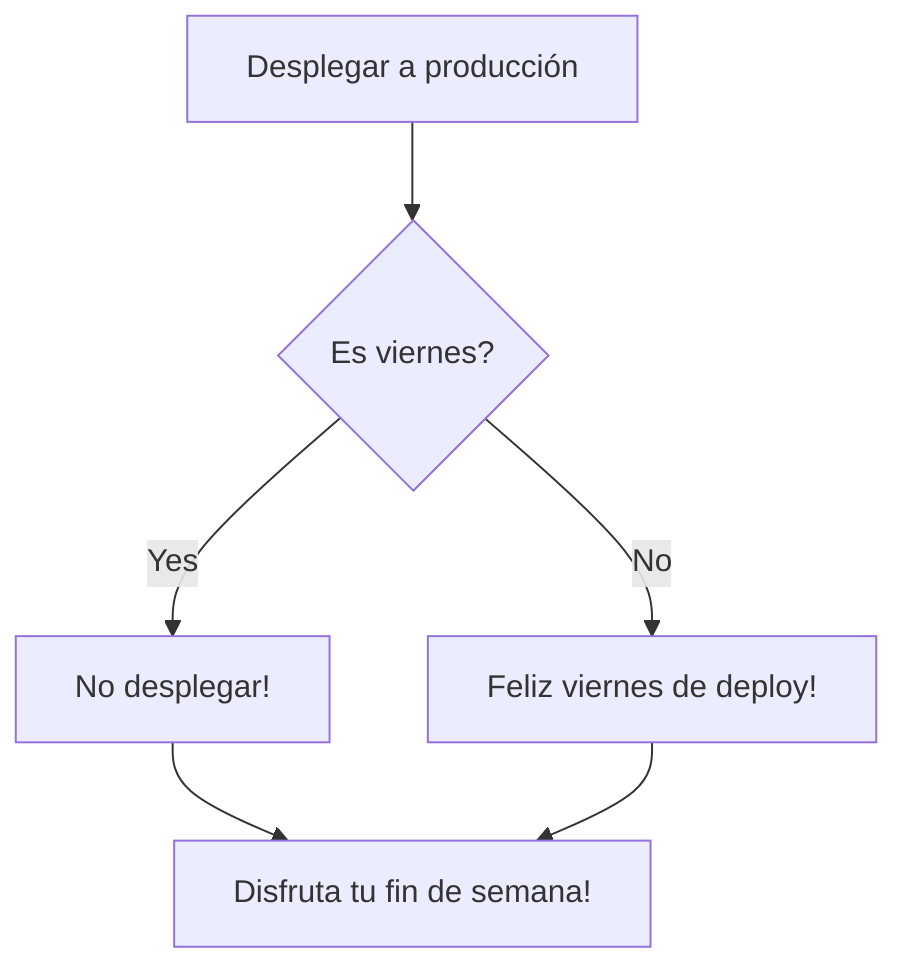

# mermaid-in-github

```mermaid
flowchart TD;
    A[Desplegar a producción] --> B{Es viernes?};
    B -- Yes --> C[No desplegar!];
    B -- No --> D[Feliz viernes de deploy!];
    C --> E[Disfruta tu fin de semana!];
    D --> E[Disfruta tu fin de semana!];
```
